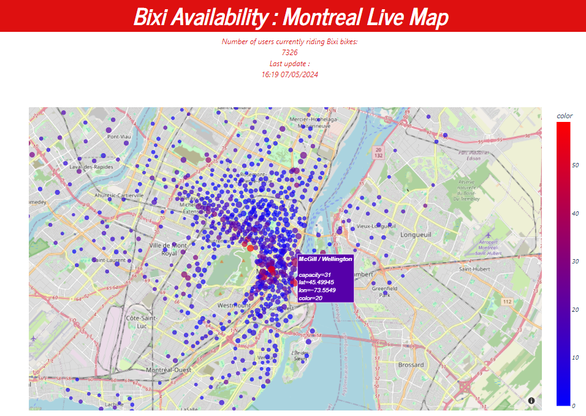

# bixi_live_dashboard



## 1. About

This project utilizes [real-time data from the Bixi bike-sharing system](https://bixi.com/fr/donnees-ouvertes/) to generate a live dashboard displaying an interactive map of the Bixi service in the city Montreal. 

### Key Features:

- **Live Data Updates**: The system performs real-time Extract, Transform, Load (ETL) operations using Airflow DAGs, fetching data in batches every 60 seconds. This ensures that the dashboard reflects the most current information available.

- **Data Storage**: PostgreSQL serves as the backend database, storing retrieved data for seamless integration with the dashboard.

- **Interactive Visualization**: Built with Python's Dash library, the dashboard allows users to interactively explore bike availability across Montreal's Bixi stations.


## 2. Using the application

### Prerequisites
- **Docker**: Ensure Docker is installed on your system. Visit the [official Docker website](https://www.docker.com/products/docker-desktop) for installation instructions adapted to your operating system.

### Installation and Deployment
The application is fully containerized, simplifying deployment and ensuring consistency across different environments.

1. Clone this repository to your local machine.
2. Navigate to the project directory.
3. Run the following command to launch the application:

```
docker compose up --build
```

4. Once the process is complete, access the dashboard through your web browser at 'localhost' or 0.0.0.0:8050.

